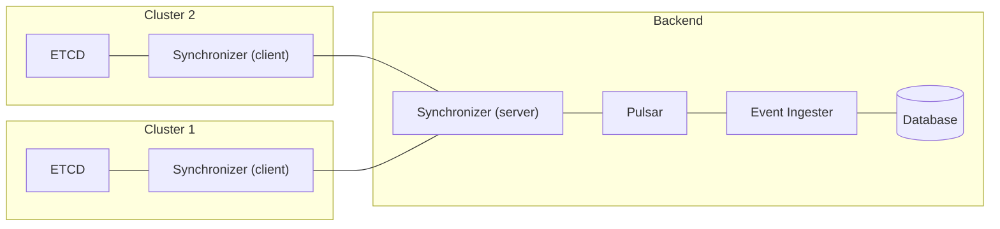

# Synchronizer

The Synchronizer serves as a data synchronization engine between in-cluster and backend resources, designed to facilitate bi-directional data synchronization between the two. It operates as an efficient event-driven data pipeline, actively monitoring a predefined list of resources for any changes. When changes occur, it efficiently propagates these updates to the relevant endpoints.



## Running the synchronizer locally

1. Run pulsar:

    ```sh
    ./scripts/pulsar.sh
    ```

2. Start synchronizer server:

    ```sh
    CONFIG=./configuration/server go run cmd/server/main.go
    ```

3. Start synchronizer client:

    ```sh
    SERVICES=./configuration/services.json CLUSTER_CONFIG=./configuration/clusterData.json CONFIG=./configuration/client go run cmd/client/main.go
    ```

## Live namespace filtering

Synchronizer can watch a shared ConfigMap for namespace filter changes without a
pod restart. This partially addresses
[kubescape/helm-charts#664](https://github.com/kubescape/helm-charts/issues/664);
Helm wiring and live filtering in other components are separate changes.

Set `inCluster.namespaceFilterConfigMapName` to `namespace-filters` in the client's
startup `config.json`. The default, an empty name, keeps existing startup-only
filtering and requires no additional permissions. `inCluster.namespace` must be
nonempty (normally populated from `clusterData.json`). Create the ConfigMap in
that namespace:

```yaml
apiVersion: v1
kind: ConfigMap
metadata:
  name: namespace-filters
  namespace: kubescape
data:
  namespaceFilters.json: |
    {
      "includeNamespaces": [],
      "excludeNamespaces": ["kube-system"],
      "includeNamespacesRegex": [],
      "excludeNamespacesRegex": []
    }
```

This document matches the Operator's live-filter format. Both exact-name fields
are required; regex fields are optional and reset to empty when omitted. Each
field accepts a comma-separated string or an array of strings. Inclusion rules
(exact names or regexes) take precedence over exclusions. Empty lists allow all
namespaces. Regexes use Go syntax; surrounding whitespace and blank regex entries
are ignored. Exact names are matched literally. Every valid document replaces
all four lists together; startup lists are not merged into it.

Grant the Synchronizer service account permission to list and watch the named
ConfigMap. Replace `synchronizer` below with the actual service account name:

```yaml
apiVersion: rbac.authorization.k8s.io/v1
kind: Role
metadata:
  name: synchronizer-namespace-filters
  namespace: kubescape
rules:
  - apiGroups: [""]
    resources: ["configmaps"]
    resourceNames: ["namespace-filters"]
    verbs: ["list", "watch"]
---
apiVersion: rbac.authorization.k8s.io/v1
kind: RoleBinding
metadata:
  name: synchronizer-namespace-filters
  namespace: kubescape
subjects:
  - kind: ServiceAccount
    name: synchronizer
    namespace: kubescape
roleRef:
  apiGroup: rbac.authorization.k8s.io
  kind: Role
  name: synchronizer-namespace-filters
```

Enabling this option initially requires deploying the updated binary and startup
configuration. Subsequent edits to `namespaceFilters.json` take effect through a
Kubernetes API watch, independent of ConfigMap volume refresh or `subPath` mounts.
Synchronization waits for the first valid document; liveness remains available.
Missing or invalid data and API/RBAC failures keep startup waiting. After the
first valid document, invalid updates, deletion, and API outages retain the last
valid rules. The watcher reconnects automatically. Malformed JSON, unknown fields,
invalid types (including `null`), and invalid regexes reject the entire update.
Applied changes are logged as `namespace filters updated`.

Live rules cover outgoing objects, patches, checksums, and fallback requests,
including initial storage enumeration, queued events, backend reads, and
reconciliation. The operator namespace and cluster-scoped resources remain
exempt; existing parent-workload filtering is preserved. ConfigMap changes do not
purge backend data, delete Kubernetes resources, trigger immediate resynchronization,
or cancel already-dispatched messages. Newly included resources synchronize on
subsequent events or reconciliation under the existing reconciliation rules.
Backend-to-cluster writes keep their existing behavior, while outgoing responses
containing excluded resource data are suppressed. Synchronizer controls resource
synchronization; it does not itself stop scans in other components.

### Cluster smoke test

1. Deploy a build containing this feature, the ConfigMap above, and its RBAC.
   Record the Synchronizer pod UID and container restart count. Use a disposable
   `payments` namespace outside the operator namespace with a Deployment that
   Synchronizer is configured to watch.
2. With both exact-name lists empty, change the Deployment and confirm its data
   reaches the test backend.
3. Run `kubectl -n kubescape edit configmap namespace-filters` and set
   `excludeNamespaces` to `["payments"]`. Wait for `namespace filters updated`,
   change the Deployment again, and exercise backend reads and reconciliation.
   Confirm no updated object, patch, or checksum is sent for that namespace and
   existing backend records remain.
4. Clear exclusions, wait for the update log, and change the Deployment again.
   Confirm synchronization resumes. Re-exclude it and repeat the suppression check.
5. Submit an invalid regex, then delete and recreate the ConfigMap. Verify the
   last valid rules remain active until a new valid document is received.
6. Confirm the pod UID and restart count are unchanged throughout the filter
   edits. Repeat with missing ConfigMap permissions at startup, then restore RBAC
   and verify synchronization starts after a valid document loads.

A live cluster/backend is required for this smoke test; fake-client tests alone
are not evidence that the Helm integration is complete.
